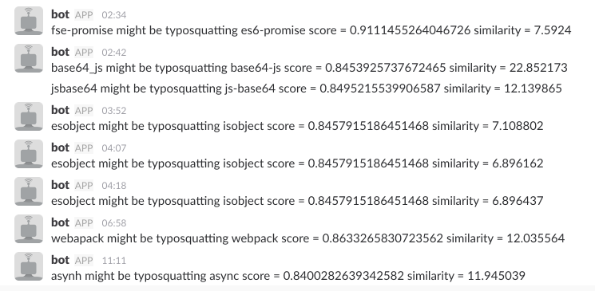
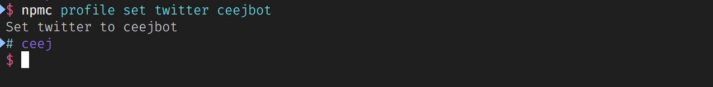
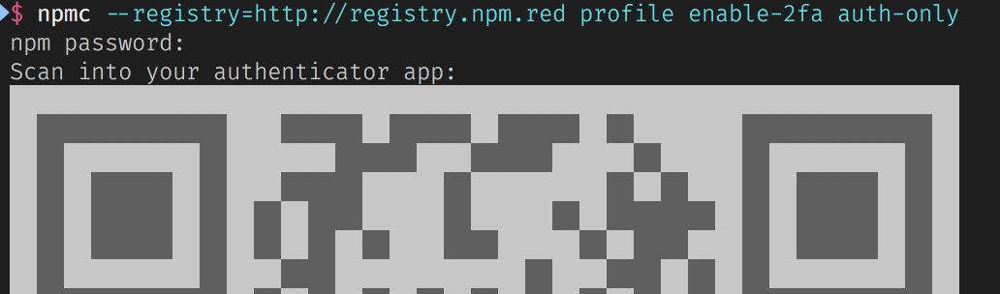

build-lists: true

# [fit] keeping javascript __safe__

---

# [fit] keeping javascript __safe__
# [fit] security & the npm registry

---

# [fit] C J Silverio
# [fit] CTO @ npm, __@ceejbot__

---

# [fit] using node since __2011__
# [fit] node has grown up!

---

# [fit] running npm's registry since __2014__
# [fit] npm has grown up too!

---

# [fit] the story of the npm registry
# [fit] __mirrors__ the story of node

---

# [fit] npm is __infrastructure__
# [fit] for millions of developers

^ just as node is. you type npm install thoughtlessly, and the packages flow as if somebody has hooked up a javascript pipe to your office.

---

# [fit] npm __dependably__ serves node packages
# [fit] __24/7__ around the world

---

# [fit] Fortune 100 companies __depend__ on npm & node

---

# [fit] __3 billion__ downloads/week
# [fit] __9 million__ users
# [fit] __156K__ package authors (1.7%)

^ those numbers are meaninglessly large

---

# [fit] npm has as many users as the
# [fit] __New York City__

---

# [fit] it didn't __start__ that way

---

# [fit] in 2009, node & npm's users
# [fit] knew each other __by name__

---

# [fit] the npm registry is now __too large__
# [fit] to depend on community policing

---

# [fit] but you need that __policing__

---

# [fit] you __rely__ on the
# [fit] packages you install

---

# questions you ask

1. Is the registry __secure__?
2. Does this package have __vulnerabilities__?
3. Is this package __malware__?
4. __Who__ published this package?

^ Let's __answer__ those questions, shall we?

---

# [fit] 1. Is the registry __secure?__

^ this is a big fluffy question

---

# [fit] What does __secure__ mean?
# [fit] registry systems can't be broken into
# [fit] data can't be tampered with

---

# [fit] we don't try to do this alone
# [fit] ongoing contract with __^Lift__

---

# [fit] this guy, Adam Baldwin
# [fit] \(he'll come up again)
# [fit] & his colleagues

---

# [fit] periodic __pen testing__
# [fit] ongoing __code reviews__

^ penetration testing gets at operational issues; code reviews at structural ones

---

# [fit] good security practices
# [fit] are __on-going work__

^ Can't just check a box and declare security "done". continuous process improvement. so we are feeling okay that the registry operations are going smoothly. We install a package.

---

# [fit] 2. Does this package
# [fit] have __vulnerabilities__?

---

# [fit] our friends at ^Lift again
# [fit] as the __Node Security Platform__

---

# [fit] NSP reviews __popular packages__,
# [fit] reports vulnerabilities, & handles reports

^ This is a noble service they provide the entire community, and we all owe them.

---

# [fit] __https://nodesecurity.io__

^ find out more about them here

---

# [fit] early access NSP data is
# [fit] integrated into __npm enterprise__

---

# [fit] newsflash! __npm__ is a company
# [fit] that sells __services__!

---

# [fit] __npm enterprise__ is
# [fit] a registry inside your firewall

^ this is a mini version of the registry

---

# [fit] NSP keeps us __informed__
# [fit] we keep them informed in turn

^ They're in our Slack. We talk often.

---

# [fit] 3. Is this package __malware__?

^ Here's another thing we talk about with NSP all the time. This is a fun one.

---

# [fit] malware doesn't __advertise__

---

# [fit] malware comes in flavors:
# [fit] __spam__ & __poison__

^ delicious

---

# [fit] __spammers__ found the registry in 2016

^ This is not a security threat to you, but it's annoying if what you want to do is find real javascript packages.

---

# [fit] two kinds of spam:
# [fit] spam __content__ & __js__ spam support

---

# [fit] npm + __cdns__ built on top ==
# [fit] trivial hosting for GA clickjacking

^ community policing is not enough

---

# [fit] now using __machine learning__ to catch spam
# [fit] thanks to the __Smyte__ service

---

# [fit] spam __speedbumps__:
# [fit] validated email to publish
# [fit] disallow throwaway addresses

---

# [fit] we seem to have made a __dent__
# [fit] but this war will never end

---

# [fit] poison-flavored malware:
# [fit] __typosquatting__

---

# [fit] publishing packages with names that
# [fit] are __very close__ to real names

---

# [fit] Historically this was __competitive__:
# [fit] authors would try to steal traffic
# [fit] to pump their download numbers

^ Ask me why I want to get rid of download counts.

---

# [fit] somebody typosquatted moment.js
# [fit] with __another__ date-formatting package

^ Punctuation in package names, sigh.

---

# [fit] also __accidental__
# [fit] JSONStream vs jsonstream

^ We don't allow upper case package names any more, but the legacy of this early mistake is still with us.

---

# [fit] recently it's been __nefarious__:
# [fit] typosquat of __cross-env__
# [fit] as __crossenv__ with a env var stealer

^ Allowing punctuation in package names is a mistake I'd like a time machine to fix

---

# [fit] typosquat of __bluebird__
# [fit] wrapping bluebird with a __cryptocoin miner__

^ Every single package that depended on coin-hive turned out to be one of these. what is is about bitcoin that attracts scammers?

---

# [fit] Adam Baldwin typosquatted
# [fit] __coffee-script__ early on

^ Also, I note once again that allowing punctuation in package names is a mistake I'd like a time machine to fix.

---

# [fit] it took __days__ for the community to notice

---

# [fit] now it takes __weeks__
# [fit] if the community notices at all

---

# [fit] as spiderman said, with
# [fit] great popularity comes __great annoyance__

---

# [fit] automated __similarity checker__

---

^ AI-level problem, but we're not doing any fancy buzzword analysis. Just word similarity analysis. A human still has to decide to act or not. but we're surfacing what to look at

---

# [fit] this war will __never end__
# [fit] so long as there is $ to be made

---

# [fit] 4. __Who__ published this package?

---

# [fit] What happens if somebody
# [fit] steals __JDD__'s auth token &
# [fit] posts malware as __lodash__?

^ We get breathless reports of worm vulnerabilities all the time because people figured out that you can use script publishing.

---

# [fit] Well, that's scary.
# [fit] npm auth tokens are __sensitive__.

---

# [fit] new! tools in the npm cli to
# [fit] help you __control auth tokens__

---

# [fit] new command: __npm token__
# [fit] control your auth tokens

---

# [fit] __npm token create --readonly__

---

# [fit] __read-only__ auth tokens
# [fit] the principle of least power

---

# [fit] give your CI system a
# [fit] __read-only__ token

---

# [fit] __npm token create --cidr=[10.0.0.1/32]__

---

# [fit] __CIDR-bound__ tokens
# [fit] bind tokens to IP ranges

---

# [fit] further __limit__ your tokens
# [fit] by controlling where they can be used

---

# [fit] __npm token list__
# [fit] __npm token delete <tokenKey>__

^ To round out the command, some useful maintainance

---

^ That's nice, CJ, but was it worth flying up to vancouver for?

---

# [fit] new command: __npm profile__

---

# [fit] set your profile data
# [fit] like your __email__ or ...

---

---

# [fit] well that's __boring__

^ CJ, I still don't understand why you flew up here.

---

---

# [fit] that's __not__ boring

---

# [fit] __npm profile enable-2fa__
# [fit] two-factor authentication is here

---

# [fit] require regular password
# [fit] plus a __one-time password__

---

# [fit] npm profile enable-2fa __auth-only__

---

# [fit] auth-only: any time you __log in__
# [fit] or manipulate __tokens__

---

# [fit] npm profile enable-2fa __auth-and-writes__

---

---

# [fit] writes: your package __publications__
# [fit] pass the `--otp` flag

---

# [fit] __npm publish --otp=123456__
# [fit] pass it on the command line!

---

# [fit] use a __TOTP code generation app__
# [fit] Google Authenticator, Authy, etc

^ Use the standard TOTP algorithm so you can use your favorite app

---

# [fit] __npm install -g npm@next__
# [fit] try it now!

^ I'm delighted to announce today that this is available for you to use *right now* in npm 5.5.1. It'll land in the latest tag when you tell us it's working right

---

# [fit] __code:__ github.com/npm/npm-profile
# [fit] __api docs:__ github.com/npm/registry

^ the npm cli implementation is open source for you to use; we want all the alt clis to use this

---

# [fit] __one more thing__

---

# [fit] coming attraction!
# [fit] protect a __package__ with 2FA

---

# [fit] require an OTP __any time__
# [fit] that package is published by anybody

^ this is regardless of whether they've turned on otp for writes

---

# [fit] protect packages with __many maintainers__
# [fit] next cli __minor release__ 5.6.0

^ almost had it ready for this release so I feel confident making this promise

---

# [fit] coming soon! 2fa for
# [fit] your npm __organization__

---

# [fit] coming soon! __npm ci__
# [fit] 3x speed for your CI installs

---

# [fit] but what about __package signing__?
# [fit] we think we've figured out how

---

# [fit] coming soon! __even more__

^ I do not have time to describe them all

---

# [fit] questions? help setting this up?
# [fit] come see me & __puppies__ at the npm booth

---

# [fit] npm wants you to
# [fit] develop in __confidence__

---

# [fit] npm loves __you__
